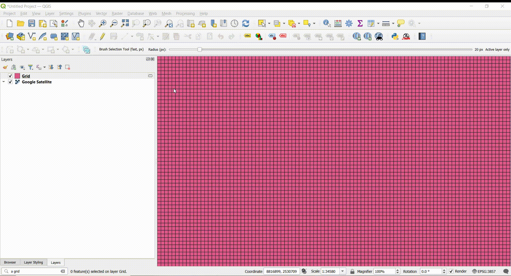

## Select Features by brush tool

The Brush Selection Tool in QGIS would allow users to select features on the map by “painting” over the vector layer with a circular brush of adjustable radius. All features that intersect with the path traced by the brush would be added to the selection.

### How it works

The Brush Selection Tool provides an intuitive "painting" interface for selecting polygon features in QGIS by dragging a circular brush cursor across the map canvas. The tool uses pixel-based radius sizing (1-200px) for consistent behavior across different coordinate systems, displays real-time visual feedback with translucent rubber bands showing the brush stroke and cursor position, and performs optimized feature selection using spatial indexing with bounding box pre-filtering. Selection occurs on mouse release, targeting either the active polygon layer only (default) or all polygon layers, with options to add to existing selections or replace them entirely.

### How to use it

The accompanying video demonstrates the brush tool's functionality and usage workflow:

[Demo Video](docs/17-26-19-Clip20250903172818.mp4)

## License

This plugin is released under the GPL-2.0-or-later license. See the [LICENSE](LICENSE) file for details.

## Credits

- **Author**: Aman Bagrecha
- **QGIS Plugin Development**: Built using QGIS Plugin Builder and Qt Designer

## Release

This project uses [qgis-plugin-ci](https://github.com/opengisch/qgis-plugin-ci) to package and publish the plugin.

### Required secrets

The GitHub release workflow requires the following repository secrets:

- `OSGEO_USERNAME` – OSGeo username with permission to publish the plugin.
- `OSGEO_PASSWORD` – Password for the OSGeo account.

### Procedure

1. Update `metadata.txt` with the new version.
2. Commit and push your changes.
3. Create and push a tag for the new version, e.g. `git tag -a 1.0.0 -m "Release 1.0.0"` and `git push origin 1.0.0`.
4. GitHub Actions will package the plugin and upload it to the QGIS plugin repository.
