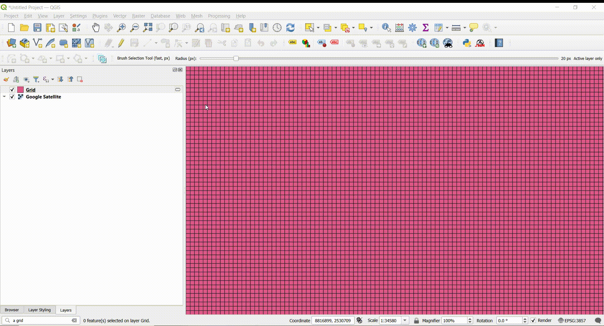

## Select Features by brush tool

The Brush Selection Tool in QGIS would allow users to select features on the map by “painting” over the vector layer with a circular brush of adjustable radius. All features that intersect with the path traced by the brush would be added to the selection.

### How it works

The Brush Selection Tool provides an intuitive "painting" interface for selecting polygon features in QGIS by dragging a circular brush cursor across the map canvas. The tool uses pixel-based radius sizing (1-200px) for consistent behavior across different coordinate systems, displays real-time visual feedback with translucent rubber bands showing the brush stroke and cursor position, and performs optimized feature selection using spatial indexing with bounding box pre-filtering. Selection occurs on mouse release, targeting either the active polygon layer only (default) or all polygon layers, with options to add to existing selections or replace them entirely.

### How to use it

The accompanying video demonstrates the brush tool's functionality and usage workflow:

## License

This project is licensed under the Creative Commons Attribution 4.0 International License (CC BY 4.0).

You are free to:
- **Share** — copy and redistribute the material in any medium or format
- **Adapt** — remix, transform, and build upon the material for any purpose, even commercially

Under the following terms:
- **Attribution** — You must give appropriate credit, provide a link to the license, and indicate if changes were made

For more details, see the [Creative Commons CC BY 4.0 License](https://creativecommons.org/licenses/by/4.0/).

## Credits

- **Author**: Aman Bagrecha
- **QGIS Plugin Development**: Built using QGIS Plugin Builder and Qt Designer

